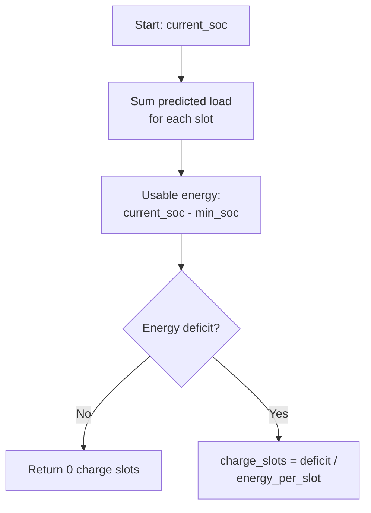
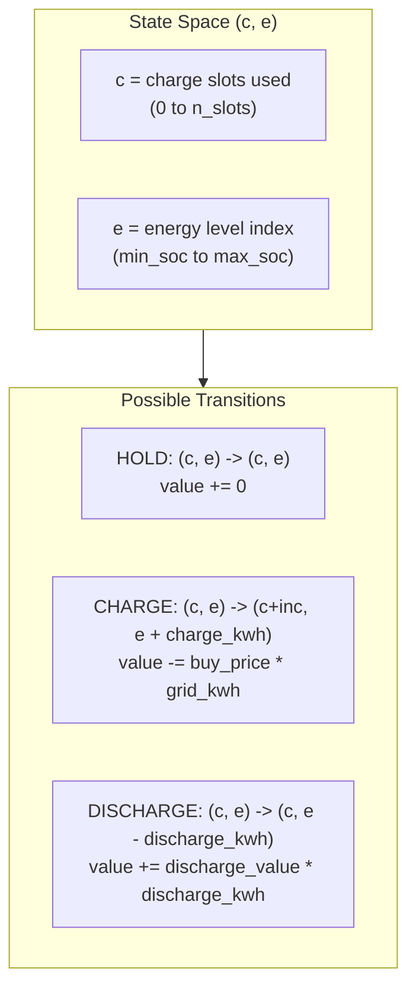
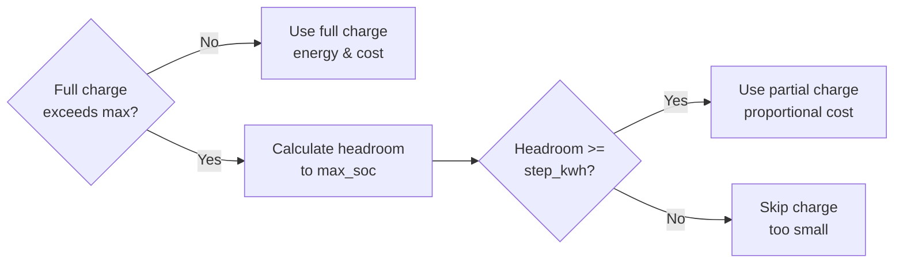
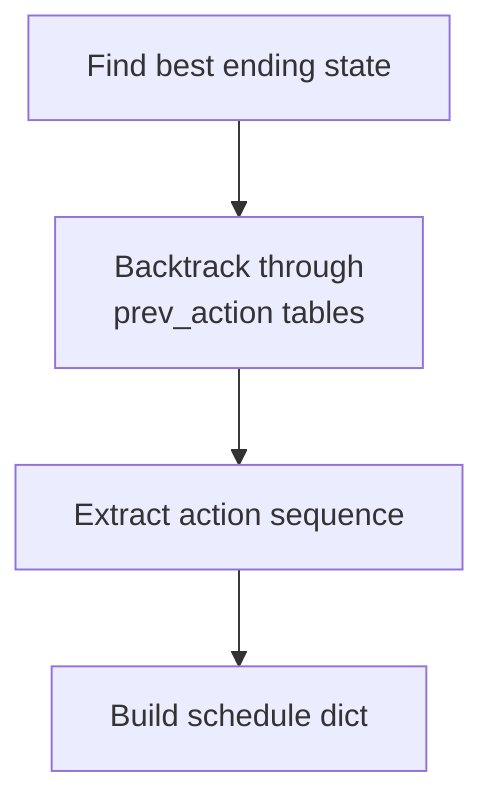
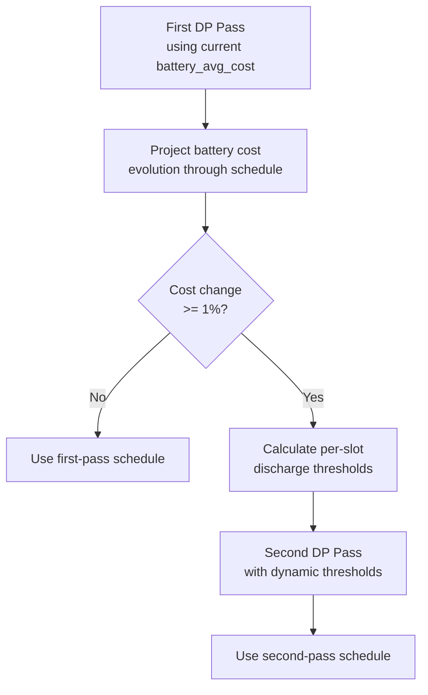
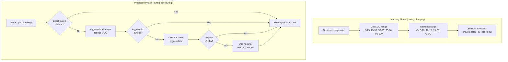
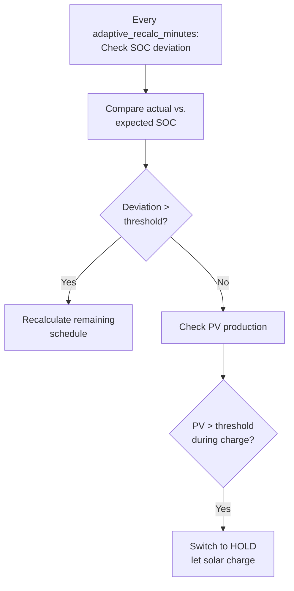
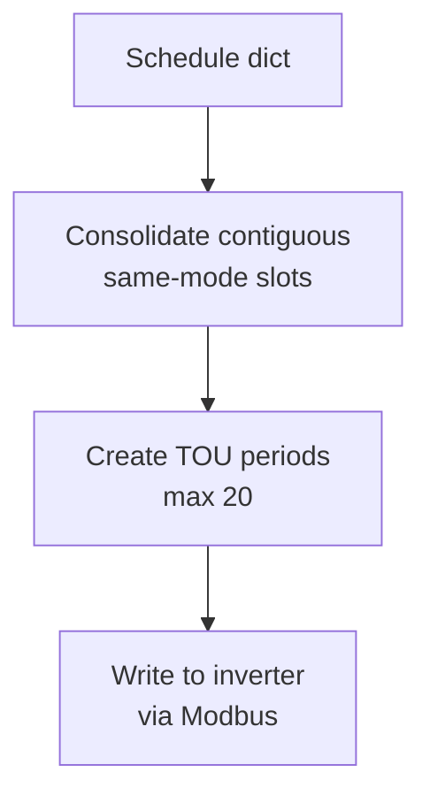

# Battery Optimizer Scheduling Algorithm

This document describes the charge/hold/discharge scheduling algorithm used by the Battery Optimizer for the Growatt WIT inverter. It reflects the current implementation in `appdaemon/apps/battery_optimizer.py`.

## Overview

The optimizer uses a dynamic programming (DP) model to produce a schedule that maximizes avoided grid cost while respecting battery constraints and ensuring the battery does not drop below `min_soc`. Decisions depend on:
- Nord Pool spot prices (normalized to the configured slot size)
- Current battery SOC
- Predicted household load (statistical profile)
- Battery constraints (capacity, charge/discharge rates, efficiency, min/max SOC)
- Economic constraints (grid fees, battery average cost, discharge cost threshold)
- PV production for adaptive charge override
- **Temperature-aware charge rate predictions** (optional, when battery temp sensor is configured)

```mermaid
flowchart TB
    subgraph Inputs
        PRICES[Nord Pool Prices]
        SOC[Current SOC]
        LOAD[Load Profile + Overrides]
        CONFIG[Battery Configuration]
        PV[PV Production]
    end

    subgraph Processing
        PRICES --> NORMALIZE[Normalize to slot_minutes]
        SOC --> MINCHARGE[Min Charge Calculation]
        LOAD --> MINCHARGE
        NORMALIZE --> DP[Dynamic Programming<br/>Optimizer]
        MINCHARGE --> DP
        CONFIG --> DP
    end

    subgraph Output
        DP --> SCHEDULE[Optimal Schedule]
        SCHEDULE --> TOU[TOU Sync to Inverter (optional)]
        SCHEDULE --> EXEC[Mode Execution]
        PV --> EXEC
    end
```

## Data Models

### Battery Modes

```python
class BatteryMode(Enum):
    HOLD = 0       # Grid covers load; battery stays idle
    CHARGE = 1     # Charge battery from grid
    DISCHARGE = 2  # Discharge battery to cover load
```

### Core Data Structures

| Structure | Fields | Purpose |
|-----------|--------|---------|
| `PricePoint` | `hour: datetime`, `price: float` | Single time-slot price data |
| `ScheduleEntry` | `hour: datetime`, `mode: BatteryMode`, `reason: str` | Scheduled action for a slot |
| `TouPeriod` | `start: int`, `end: int`, `power: int` | Inverter TOU register format |

## Algorithm Pipeline


### Step 1: Price Fetching

Prices are fetched from Home Assistant in one of two ways:
- **Built-in Nord Pool integration** via `nordpool/get_prices_for_date` service
- **HACS custom component** via sensor attributes

Key behaviors:
- **Tomorrow prices** are only fetched once `now.hour >= tomorrow_prices_hour` (apps.yaml default: 14, which is 13:00 CET for EET).
- **Normalization**: price resolution is normalized to `slot_minutes`.
  - If source data is finer than `slot_minutes`, prices are averaged per slot.
  - If source data is coarser, each price is expanded into multiple slots.
- **Missing current slot**: if the current slot price is missing, the optimizer synthesizes it by:
  1. Using yesterday's price for the same slot if available
  2. Otherwise, using the most recent past price
  3. Otherwise, using the next future price
- **Caching**: cached prices from today or yesterday are used if fresh data is unavailable.
- **Timezone handling**: comparisons are done in the local timezone; mixed naive/aware datetimes are normalized before comparison.

### Step 2: Minimum Charge Calculation

Before DP, the optimizer calculates the **minimum number of charge slots** needed to avoid hitting `min_soc` over the planning horizon. This is an aggregate energy check (not a step-by-step SOC simulation).



**Formula:**
```
usable_energy = (current_soc - min_soc) / 100 * battery_capacity
slot_load_kwh = min(predicted_load_kw, discharge_rate) * slot_hours
total_load = sum(slot_load_kwh over horizon)
deficit = total_load - usable_energy
energy_per_slot = charge_rate * efficiency * slot_hours
charge_slots = ceil(deficit / energy_per_slot)
```

Notes:
- Uses the same load prediction logic as DP (load profile).
- Uses **future prices only** (from the current slot onward).
- If deficit <= 0, `charge_slots` is 0.

### Step 3: Dynamic Programming Optimization

The core algorithm uses DP with SOC state tracking to find the globally optimal schedule.

#### State Space

The algorithm discretizes the problem into:
- **Time slots**: each price point represents one slot (`slot_minutes`)
- **Energy levels**: battery energy discretized by `soc_step_percent`
- **Charge count**: number of charge slots used (to enforce minimum charge constraint)



#### Slot Fractions (partial current slot)

If the optimization starts part-way into the current slot, a **fraction** of the slot is used:
- Energy added/removed is scaled by the fraction remaining in the slot.
- **Charge slot counting**: the current partial slot does **not** count as a full charge slot toward `min_charge_slots`. Only full slots (fraction >= 0.999) increment the charge count.
- **Partial-slot decision**: the algorithm enumerates HOLD/CHARGE/DISCHARGE for the current partial slot, then runs DP on the remaining full slots. If any candidate can still satisfy `min_charge_slots`, it is preferred over higher-value candidates that cannot.

#### DP Table Structure

```
dp[c][e] = best value achievable with c charge slots and energy level e
dp_tie[c][e] = secondary score used only to break near-ties (prefers cheaper/later charge slots)
prev_idx[t][c][e] = energy index at time t-1 that led to (c, e) at time t
prev_c[t][c][e] = charge count at time t-1 that led to (c, e) at time t
prev_action[t][c][e] = action (HOLD/CHARGE/DISCHARGE) taken to reach (c, e)
```

#### Transition Logic

For each time slot `t`, the algorithm evaluates three possible actions:

##### 1. HOLD
```
next_dp[c][e] = max(next_dp[c][e], dp[c][e])
```
- No energy change
- No value change

##### 2. CHARGE
```
if allow_charge:
    inc = 0 if slot_fraction < 0.999 else 1
    new_energy = e + charge_energy
    actual_charge = charge_energy
    actual_cost = charge_cost_kwh

    # Partial charge: top off at max_soc if full charge would exceed
    if new_energy > max_energy:
        headroom = max_energy - e
        if headroom >= step_kwh:
            actual_charge = headroom
            actual_cost = headroom / efficiency
            new_energy = max_energy
        else:
            actual_charge = 0  # Too small

    if actual_charge > 0:
        cost = buy_price * actual_cost
        next_dp[c+inc][e'] = max(next_dp[c+inc][e'], dp[c][e] - cost)
```

**Tie-breaking (charge placement):**
If objective values are effectively equal (within a small epsilon), the DP uses a secondary score (`dp_tie`) to prefer cheaper and later charge slots.

**Partial Charge Support:**

When the battery is close to `max_soc` and a full charge slot would exceed the limit, the algorithm allows a **partial charge** to "top off" the battery:



**Example:** With `max_soc=100%`, `charge_rate=4.5kW`, `efficiency=0.95`:
- Each full charge slot adds ~30% SOC (4.275 kWh)
- At 77% SOC, a full charge would reach 107% (blocked)
- Partial charge: 23% SOC (3.29 kWh) to reach exactly 100%
- Cost is proportional: `3.29 / 0.95 = 3.46 kWh` from grid

This prevents the scenario where cheap morning prices go unused because the battery is "almost full", forcing expensive evening charging instead.

**Favorable-slot gating:**
- The optimizer precomputes which slots are **favorable** for charging (`price <= battery_avg_cost * 1.05`).
- It also precomputes how many favorable slots remain from each time index to the end of the horizon.
- Unfavorable charging is only permitted when **there are not enough favorable slots left** to still reach `min_charge_slots`.

**Charge is allowed when:**
- Price is economically favorable (`price <= battery_avg_cost * 1.05`) using the **raw spot price** (no grid fee), OR
- There are **not enough favorable slots remaining** to still reach `min_charge_slots` (so the optimizer must use an unfavorable slot to survive the horizon)

##### 3. DISCHARGE
```
discharge_value = (price + grid_fee)
if e - discharge_energy >= min_energy:
    value = discharge_value * discharge_kwh
    next_dp[c][e'] = max(next_dp[c][e'], dp[c][e] + value)
```

**Discharge is modeled as self-consumption:**
```
discharge_kwh = min(predicted_load_kw, discharge_rate) * slot_hours * slot_fraction
```

#### Value Calculations

| Mode | Value Formula | Description |
|------|---------------|-------------|
| CHARGE | `-(price + grid_fee) * grid_kwh` | Cost to buy grid energy for charging |
| DISCHARGE | `+(price + grid_fee) * discharge_kwh` | Avoided import cost from self-consumption |
| HOLD | `0` | No cost or value |

Where:
```
charge_energy_kwh = charge_rate * efficiency * slot_hours * slot_fraction
charge_cost_kwh = charge_rate * slot_hours * slot_fraction  # grid energy
```

Notes:
- `export_rate_multiplier` is currently **not used** because discharge is modeled as self-consumption only.

#### Algorithm Pseudocode

```
initialize dp[0][start_energy_idx] = 0
for each time slot t:
    for each charge_count c:
        for each energy_level e:
            if dp[c][e] is valid:
                # Try HOLD
                update next_dp[c][e] if better

                # Try CHARGE (if allowed)
                # favorable_remaining[t] = number of favorable slots from t..end
                if (price <= battery_avg_cost * 1.05) OR (c + favorable_remaining[t] < min_charge_slots):
                    inc = 0 if slot_fraction < 0.999 else 1
                    new_energy = e + charge_energy
                    actual_charge = charge_energy
                    actual_cost = charge_cost

                    # Partial charge: allow top-off when near max_soc
                    if new_energy > max_energy:
                        headroom = max_energy - e
                        if headroom >= step_kwh:
                            actual_charge = headroom
                            actual_cost = headroom / efficiency
                            new_energy = max_energy
                        else:
                            actual_charge = 0

                    if actual_charge > 0:
                        update next_dp[c+inc][new_e] with cost = buy_price * actual_cost
                        # If equal within epsilon, prefer cheaper/later charge slots

                # Try DISCHARGE
                discharge_value = (price + grid_fee)
                new_energy = e - discharge_energy
                if new_energy >= min_energy:
                    update next_dp[c][new_e] if better

    dp = next_dp

# Find best final state (c >= min_charge_slots, maximize value)
# If no state can satisfy min_charge_slots, fall back to best value overall
# Backtrack to extract optimal actions

# Two-pass enhancement:
# If scheduled charging changes battery_avg_cost by >= 1%:
#   - Project costs through the schedule
#   - Re-run DP with per-slot discharge thresholds
```

### Step 4: Schedule Construction

After DP completes, the algorithm:
1. Finds the best ending state (highest value with `c >= min_charge_slots`)
2. Backtracks through the DP tables to extract the optimal action sequence
3. Builds a schedule mapping `datetime -> ScheduleEntry`



Each `ScheduleEntry.reason` is a human-readable string like:
- `Charge @ 0.0432 EUR/kWh`
- `Discharge @ 0.2156 EUR/kWh (load~1.50kW)`
- `Hold @ 0.0398 EUR/kWh`

### Step 5: Two-Pass Optimization (Projected Costs)

After the initial DP pass, the optimizer checks if scheduled charging would significantly change the battery's average cost. If so, it re-runs DP with **per-slot discharge thresholds** based on projected costs.



**Why Two Passes?**

The discharge threshold depends on battery average cost:
```
discharge_threshold = ((battery_avg_cost + grid_fee) / efficiency) + battery_wear_cost + grid_fee
```

When scheduling multiple charge slots at low prices, the battery's average cost drops. This makes previously marginal discharge slots more attractive. The two-pass approach captures this:

1. **Pass 1**: Uses current `battery_avg_cost` for all slots
2. **Project costs**: Simulates the schedule to see how `battery_avg_cost` evolves
3. **Pass 2** (if cost changes ≥1%): Uses per-slot thresholds based on projected costs

**Example:**
- Current battery cost: 0.10 EUR/kWh → threshold ≈ 0.11 EUR/kWh
- After morning charge at 0.05 EUR/kWh: projected cost ≈ 0.07 EUR/kWh → threshold ≈ 0.08 EUR/kWh
- Afternoon slot at 0.09 EUR/kWh: Pass 1 says HOLD, Pass 2 says DISCHARGE

## Load Profile Prediction

The optimizer uses a statistical load profile for discharge predictions.

```mermaid
flowchart TB
    OBSERVE[Observe actual load]
    RECORD[Record by time-of-day slot]
    SAMPLES[Store up to N samples<br/>per slot]
    QUANTILE[Calculate quantile
(default 75th percentile)]
    BLEND[Blend with default
based on confidence]
    PREDICT[Return predicted load kW]

    OBSERVE --> RECORD --> SAMPLES
    SAMPLES --> QUANTILE --> BLEND --> PREDICT
```

**Key Features:**
- **Data source**: `load_power_sensor` in W. If not configured, uses `base_consumption_w`.
- **Zero-floor handling**: if the load sensor reports 0 W, the optimizer uses the last non-zero reading or `load_zero_floor_w`.
- **Quantile forecasting**: configurable `load_quantile` (default 0.75).
- **Confidence blending**: blends quantile with `base_consumption_w` based on sample count (`len(samples)/load_profile_min_samples`).
- **Sampling limits**: stores up to `load_profile_max_samples` per slot.

## Temperature-Aware Charge Rate Prediction

The optimizer can learn and predict charge rates based on battery temperature, improving scheduling accuracy for batteries that charge slower when cold (common with lithium batteries).

### How It Works

When a battery temperature sensor is configured (`battery_temp_sensor`), the learning engine tracks charge rates in a 2D matrix indexed by SOC range and temperature range:

Each learning observation uses the SOC delta for energy and the elapsed time since the last significant SOC change (>=1%). Polls with unchanged SOC do not count toward the duration, which keeps the rate correct when the inverter reports SOC in 1% steps.



### Temperature Ranges

| Range | Expected Battery Behavior |
|-------|---------------------------|
| `<5°C` | Severely limited (BMS protection) |
| `5-10°C` | Reduced rate (~3kW typical) |
| `10-15°C` | Moderate reduction |
| `15-20°C` | Near-nominal |
| `>20°C` | Full rate (~6kW typical) |

### Temperature Rate Forecast in Scheduling

Scheduling uses a neutral forecast for charge rates:
- Per-slot charge rates are computed using the current SOC and current temperature.
- The same rate is applied across the planning horizon.
- No warm-up or cooling is modeled in the scheduler.

### Fallback Behavior

The system degrades gracefully when temperature data is unavailable:

1. **No temp sensor configured** → Uses SOC-only learned rates
2. **Sensor unavailable/unknown** → Uses SOC-only learned rates
3. **No data for SOC+temp combo** → Aggregates nearby temps, then SOC-only
4. **No learned data at all** → Uses configured `charge_rate_kw`

### Persistence

Temperature-aware learning data is persisted in the same file as other learning data (`learning_data_file`). The persistence format is version 5:
- **Backward compatibility**: v5 code can read v1-v4 files without issues (unused fields are ignored).
- **Per-bucket confidence**: Each SOC and SOC+temp bucket tracks its own observation count; confidence is computed per-bucket rather than globally.

### Per-Bucket Confidence Calculation

Confidence is computed based on the data source and observation count:

| Data Source | Base Confidence | Max Confidence | Formula |
|-------------|-----------------|----------------|---------|
| SOC+temp exact match | 0.7 | 1.0 | `0.7 + min(0.3, (count-3)/7 * 0.3)` |
| SOC+temp aggregated | 0.5 | 0.7 | `0.5 + min(0.2, (count-3)/12 * 0.2)` |
| SOC-only data | 0.3 | 0.5 | `0.3 + min(0.2, (count-3)/7 * 0.2)` |
| Nominal fallback | 0.0 | 0.0 | No data available |

### Sensor Attributes

Temperature and learning data is exposed in sensor attributes:

| Sensor | Attribute | Description |
|--------|-----------|-------------|
| `sensor.battery_optimizer` | `current_battery_temp` | Current battery temperature (°C) |
| `sensor.battery_optimizer` | `current_predicted_rate` | Predicted charge rate (kW) for current SOC+temp |
| `sensor.battery_optimizer` | `temp_aware_rates` | Summary of learned rates by SOC and temperature |
| `sensor.battery_learning_stats` | `total_observations` | Total charging observations across all buckets |
| `sensor.battery_learning_stats` | `soc_charge_rates` | Per-SOC rates with observation count and confidence |
| `sensor.battery_learning_stats` | `temp_aware_rates` | Per-SOC+temp rates with observation count and confidence |

## Adaptive Re-optimization

The schedule is not static. The system continuously monitors and adapts:



**Recalculation Triggers:**
1. **SOC deviation**: actual SOC differs from expected by more than `soc_deviation_threshold`.
   - Expected SOC is adjusted within the current slot based on elapsed minutes.
   - When triggered, only **future slots** are recalculated and the schedule is replaced from the current slot onward.
2. **Solar override**: if `pv_power_sensor` > `pv_threshold_w` while the current mode is CHARGE, the optimizer switches to HOLD (schedule is not rewritten).

## Battery Cost Tracking

The optimizer tracks a **weighted average cost** of energy in the battery and updates it based on actual SOC changes (only if SOC changes by >= 1%).

```
old_energy = max(0, (old_soc - min_soc) / 100 * battery_capacity)
new_avg_cost = (old_energy * old_avg_cost + energy_added * charge_price) / (old_energy + energy_added)
```

Notes:
- Cost tracking only applies to **usable energy above `min_soc`**.
- Charging price is taken from the previous slot price if available; otherwise it falls back to the current average cost.
- Discharging does not change the average cost (only reduces energy).

How it is used:
- **Charging gate in DP**: allow extra charging if `price <= battery_avg_cost * 1.05` (raw price, no grid fee).
- **Discharge cost in DP**: `((battery_avg_cost + grid_fee) / efficiency) + battery_wear_cost` is used as a per-kWh penalty in discharge value (and is also exposed as a sensor attribute).

## TOU Sync to Inverter

The generated schedule can be synced to the inverter's Time-of-Use registers.



**TOU Period Format:**
- Start: minutes since midnight
- End: minutes since midnight (XX:59 format to prevent overlap)
- Power: -100 to +100

**Important behaviors:**
- **HOLD mode** is encoded as **+1% charge** (firmware quirk required for true standby).
- Schedule is built from today + tomorrow **time-of-day** entries; if the same minute appears twice, today's entry wins.
- Maximum of 20 periods; extra periods are truncated.
- When TOU sync is enabled, hourly `set_mode` is skipped to avoid clearing TOU periods; the inverter follows the synced schedule.

## Configuration Parameters (apps.yaml defaults)

### Battery and Scheduling

| Parameter | Default | Description |
|-----------|---------|-------------|
| `battery_capacity_kwh` | 14.3 | Total battery capacity |
| `charge_rate_kw` | 4.5 | Max charge rate used for planning |
| `discharge_rate_kw` | 4.5 | Max discharge rate used for planning |
| `efficiency` | 0.95 | Round-trip efficiency used in planning |
| `min_soc` | 10 | Minimum allowed SOC (%) |
| `max_soc` | 100 | Maximum allowed SOC (%) |
| `slot_minutes` | 60 | Slot duration for schedule |
| `soc_step_percent` | 1.0 | DP SOC discretization step |
| `tomorrow_prices_hour` | 14 | Hour when tomorrow prices are fetched (local time) |
| `battery_temp_sensor` | `` | Battery temperature sensor for temp-aware learning (optional) |

### Load Forecasting

| Parameter | Default | Description |
|-----------|---------|-------------|
| `load_power_sensor` | `sensor.growatt_power_to_load` | Source sensor for load (W) |
| `base_consumption_w` | 500 | Default load used without data |
| `load_quantile` | 0.75 | Quantile for load prediction |
| `load_profile_max_samples` | 60 | Max samples stored per slot |
| `load_profile_min_samples` | 6 | Samples required for full confidence |
| `load_zero_floor_w` | 450 | Minimum load if sensor reports 0 |
| `load_observation_minutes` | 30 | Interval for recording load samples |

### Pricing and Economics

| Parameter | Default | Description |
|-----------|---------|-------------|
| `grid_fee_eur_kwh` | 0.00 | Fixed grid fee added to price |
| `battery_wear_cost_eur_kwh` | 0.00 | Per-kWh wear cost added to discharge cost |
| `export_rate_multiplier` | 0.95 | Export multiplier (currently unused in DP) |

### Adaptive Control

| Parameter | Default | Description |
|-----------|---------|-------------|
| `adaptive_recalc_minutes` | 30 | Interval for adaptive optimization |
| `pv_threshold_w` | 500 | PV threshold for solar override |
| `soc_deviation_threshold` | 5 | SOC deviation trigger (%) |
| `decision_log_level` | 1 | Decision transparency logging level |

## Example Schedule

```
Time     Price      Mode       Reason
00:00    0.0432     CHARGE     Charge @ 0.0432 EUR/kWh
01:00    0.0385     CHARGE     Charge @ 0.0385 EUR/kWh
02:00    0.0398     HOLD       Hold @ 0.0398 EUR/kWh
...
17:00    0.2156     DISCHARGE  Discharge @ 0.2156 EUR/kWh (load~1.50kW)
18:00    0.2489     DISCHARGE  Discharge @ 0.2489 EUR/kWh (load~2.10kW)
19:00    0.2234     DISCHARGE  Discharge @ 0.2234 EUR/kWh (load~1.80kW)
...
```

## Complexity Analysis

| Aspect | Complexity | Notes |
|--------|------------|-------|
| Time | O(T * C * E) | T=slots, C=max charges, E=energy states |
| Space | O(T * C * E) | For backtracking tables |
| Typical values | T=24-48, C=24-48, E~90 | ~150K-200K operations per optimization |
| Two-pass | 2 × O(T * C * E) | Only when battery cost changes ≥1% |

## Key Design Decisions

1. **Self-consumption model**: Discharge is modeled as avoiding grid import, not exporting.
2. **Survival-first charging**: Minimum charge slots prevent hitting `min_soc`.
3. **Economic charging with survival fallback**: Prefer favorable prices; only allow unfavorable charging when there are too few favorable slots left to meet `min_charge_slots`.
4. **Partial-slot handling**: Partial current slots do not increment the charge count; candidates that still satisfy `min_charge_slots` are preferred.
5. **Tie-breaking for charge placement**: When values are effectively equal, the DP prefers cheaper and later charge slots.
6. **Partial charge support**: When near `max_soc`, allows partial "top off" charging to fully utilize cheap price windows instead of blocking the entire slot.
7. **Two-pass optimization**: Re-runs DP with projected battery costs when scheduled charging would significantly change the cost basis, enabling better discharge decisions.
8. **Economic discharge**: Discharge value is reduced by battery cost `((avg + grid_fee)/eff + wear)`, creating HOLD when price is marginal.
9. **Conservative load forecasting**: 75th percentile default guards against peaks.
10. **Adaptive recalculation**: Real-world SOC deviations trigger schedule updates.
11. **Timezone awareness**: Handles DST and mixed timezone data correctly.
12. **Temperature-aware learning**: Learns actual charge rates by SOC and temperature, improving scheduling accuracy for batteries with temperature-dependent performance (e.g., slower charging when cold).

## Algorithm Flow Summary

```mermaid
sequenceDiagram
    participant User as User/Timer
    participant Opt as Optimizer
    participant DP as DP Algorithm
    participant Inv as Inverter

    User->>Opt: Trigger optimization
    Opt->>Opt: Fetch and normalize prices
    Opt->>Opt: Get current SOC
    Opt->>Opt: Calculate min charge slots
    Opt->>DP: Run DP optimization
    DP->>DP: Initialize state (SOC, charge_count=0)
    loop For each time slot
        DP->>DP: Evaluate HOLD/CHARGE/DISCHARGE
        DP->>DP: Update best values
    end
    DP->>DP: Backtrack for optimal path
    DP-->>Opt: Return schedule
    Opt->>Inv: Sync TOU periods (optional)
    Opt->>Opt: Execute current mode

    loop Every adaptive_recalc_minutes
        Opt->>Opt: Check SOC deviation
        alt Deviation > threshold
            Opt->>DP: Recalculate remaining schedule
            DP-->>Opt: Updated schedule
            Opt->>Inv: Re-sync TOU periods
        end
    end
```
